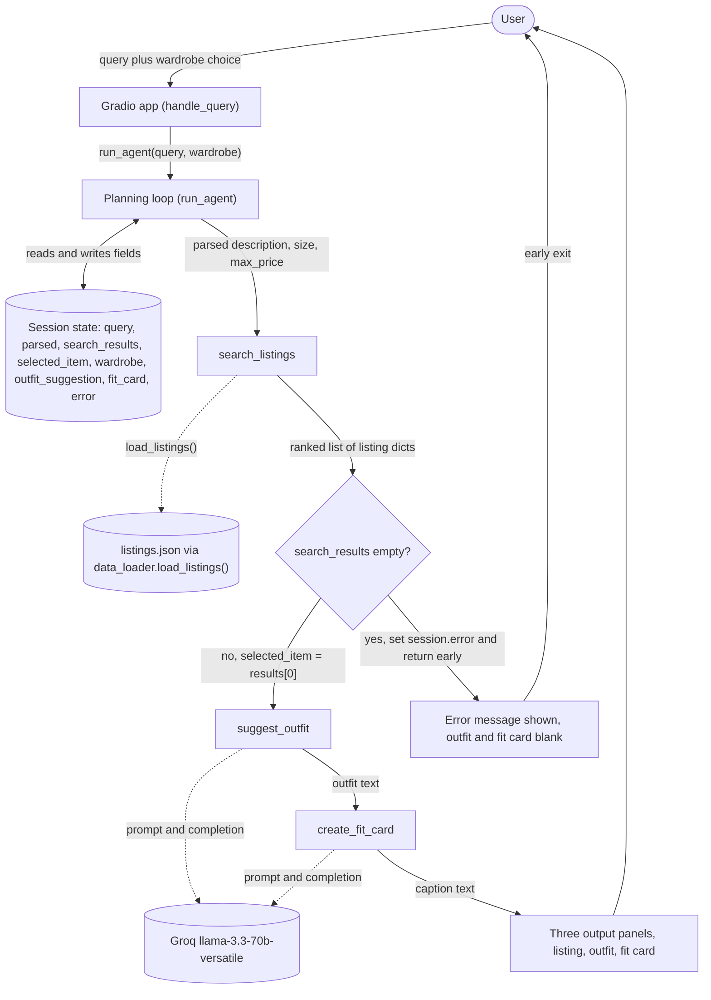

# FitFindr — planning.md

> Complete this document before writing any implementation code.
> Your spec and agent diagram are what you'll use to direct AI tools (Claude, Copilot, etc.) to generate your implementation — the more specific they are, the more useful the generated code will be.
> Your planning.md will be reviewed as part of your submission.
> Update it before starting any stretch features.

---

## Tools

List every tool your agent will use. For each tool, fill in all four fields.
You must have at least 3 tools. The three required tools are listed — add any additional tools below them.

### Tool 1: search_listings

**What it does:**
It scans the mock listings dataset and returns the items that match a text description, with optional size and price limits. It ranks the matches by how well they overlap the description so the agent can take the best one.

**Input parameters:**
- `description` (str): free text keywords for the item the user wants, for example "vintage graphic tee". This drives the relevance scoring.
- `size` (str or None): a size string to filter on, matched case insensitively as a substring so "M" also keeps "S/M". None skips the size filter.
- `max_price` (float or None): an inclusive price ceiling in dollars, so a listing is kept only when its price is at or below this value. None skips the price filter.

**What it returns:**
A list of listing dicts ranked best match first, or an empty list when nothing matches. It never raises. Each dict is a full listing from `data/listings.json` and carries all of these fields, `id` (str), `title` (str), `description` (str), `category` (str, one of tops, bottoms, outerwear, shoes, accessories), `style_tags` (list of str), `size` (str, freeform such as "M", "S/M", "W30 L30", "US 8", "One Size"), `condition` (str, one of excellent, good, fair), `price` (float), `colors` (list of str), `brand` (str or None), and `platform` (str, one of depop, thredUp, poshmark).

The ranking is built like this so it can be implemented without guessing. Load every listing with `load_listings()` from `utils/data_loader.py`. When `max_price` is set, drop listings priced above it. When `size` is set, drop listings whose `size` field does not contain the argument as a case insensitive substring. For each survivor, lowercase and tokenize the description, ignore tiny stopwords like a, the, for, with, and under, and count how many remaining tokens appear as substrings in the listing's combined text of title, description, style_tags, colors, category, and brand. That count is the score. Drop anything scoring zero, then sort by score from high to low and break ties by lower price.

**What happens if it fails or returns nothing:**
It returns an empty list instead of raising. The planning loop treats that empty list as a stop signal, writes a specific message into the session that names what was searched and what to loosen, and skips suggest_outfit and create_fit_card entirely. The exact wording is in the Error Handling table.

---

### Tool 2: suggest_outfit

**What it does:**
It takes one listing the user is considering plus the user's wardrobe and asks the language model for one or two complete outfits built around that item. With a stocked wardrobe it names real pieces, and with an empty wardrobe it gives general styling advice for the item instead.

**Input parameters:**
- `new_item` (dict): a single listing dict, normally `search_results[0]` from search_listings, with the fields listed under Tool 1. The model uses its title, description, style_tags, colors, and category.
- `wardrobe` (dict): a wardrobe object shaped as `{"items": [...]}`, from `get_example_wardrobe()` or `get_empty_wardrobe()`. Each item has `id` (str), `name` (str), `category` (str), `colors` (list of str), `style_tags` (list of str), and `notes` (str or None). The items list can be empty.

**What it returns:**
A non-empty plain text string holding one or two outfit ideas. With a stocked wardrobe it refers to specific pieces by name, for example the baggy dark-wash jeans and chunky white sneakers, and adds a concrete styling tip such as how to tuck or layer. With an empty wardrobe it gives general pairing ideas by category and vibe. The string is shown to the user and also passed on to create_fit_card.

To build the prompt, if `wardrobe["items"]` is empty it sends the model only the new item and asks for general styling guidance. Otherwise it formats each wardrobe item into a short line of name, category, colors, and tags, includes the new item, and asks for named outfit combinations. It calls Groq's llama-3.3-70b-versatile through `_get_groq_client()` at a moderate temperature near 0.7.

**What happens if it fails or returns nothing:**
An empty wardrobe is a handled branch, not a failure, and still returns useful general advice. If the Groq call itself errors, for instance a network or key problem, the tool catches it and returns a plain fallback suggestion built from the item's own fields, so the agent stays useful. It never returns an empty string and never raises.

---

### Tool 3: create_fit_card

**What it does:**
It turns an outfit suggestion and its item into a short shareable caption, the kind of thing someone posts with an outfit photo. It is written to sound like a real person rather than a product blurb, and to come out different each time.

**Input parameters:**
- `outfit` (str): the outfit suggestion text, normally the string returned by suggest_outfit.
- `new_item` (dict): the listing dict for the thrifted item, with the Tool 1 fields. The caption pulls the item's title, price, and platform from here.

**What it returns:**
A string of two to four sentences usable as an Instagram or TikTok caption. It mentions the item name, price, and platform once each, names the outfit vibe in specific terms, and reads casually. It runs at a higher temperature near 1.0 so repeated calls and different items produce different captions.

**What happens if it fails or returns nothing:**
If `outfit` is empty or only whitespace, it does not call the model. It returns a plain message telling the user an outfit is needed first, so the caption panel shows that rather than a broken or empty card. If the Groq call errors, it returns a simple fallback caption built from the item fields. It never raises.

---

### Additional Tools (if any)

No tools beyond the three required ones are part of this build. If I take a stretch goal later, the likely addition is a price check tool, something like price_check(item) that compares an item's price against similar listings in the dataset and returns a fair, high, or low read along with the comparison set. I will fill in a full block here and update the rest of the doc before I build it.

---

## Planning Loop

**How does your agent decide which tool to call next?**

The loop lives in `run_agent(query, wardrobe)` in `agent.py`. It runs the tools in a set order but lets the results decide whether it keeps going, which fits a flow where each step needs the previous step's output. Here is every branch.

1. Build the session with `_new_session(query, wardrobe)`. Every result field starts empty and `error` starts as None.

2. Parse the query into `session["parsed"]` as a dict of description, size, and max_price. I parse with regular expressions rather than the model to keep it cheap and predictable. Pull `max_price` from patterns like "under $30", "less than 30", or "$30", taking the first number as a float, otherwise None. Pull `size` from an explicit "size X" phrase or a standalone size token from a known set, using word boundaries so the m in summer is not read as a size, otherwise None. Set `description` to the query with the price phrase, size phrase, and leading filler like "looking for a" removed, then cut at the first period so a trailing style sentence like "I mostly wear baggy jeans" does not leak into the search keywords. If that leaves the description empty, fall back to the whole query.

3. Call `search_listings(description, size, max_price)` and store the list in `session["search_results"]`.

4. Branch on that list. If it is empty, set `session["error"]` to a specific message naming the description, size, and price that were searched and suggesting what to loosen, then return the session immediately and call neither styling tool. If it is not empty, set `session["selected_item"] = search_results[0]` and go on.

5. Call `suggest_outfit(session["selected_item"], session["wardrobe"])` and store the string in `session["outfit_suggestion"]`. The empty wardrobe case is handled inside the tool, so the loop does not branch on it. As a guard, if the returned string is somehow empty, set `session["error"]` to a short message and return before the fit card, since a caption needs an outfit.

6. Call `create_fit_card(session["outfit_suggestion"], session["selected_item"])` and store the string in `session["fit_card"]`.

7. Return the session. The caller reads `session["error"]` first, and when it is None the selected_item, outfit_suggestion, and fit_card fields are all populated.

The run is finished when it either returns early at step 4 or completes step 6. A styling tool is never called on empty input, which is the reason the step 4 branch exists.

---

## State Management

**How does information from one tool get passed to the next?**

All state for one interaction lives in a single session dict created by `_new_session(query, wardrobe)` in `agent.py`. It is the single source of truth, and every tool result is written back into it, so later tools read from the session instead of asking the user again.

The tracked fields are `query` (the raw text), `parsed` (the extracted description, size, and max_price), `search_results` (the ranked list from search_listings), `selected_item` (the chosen listing, set to `search_results[0]`), `wardrobe` (the wardrobe dict passed in at the start), `outfit_suggestion` (the string from suggest_outfit), `fit_card` (the string from create_fit_card), and `error` (None unless the run stopped early).

The handoffs are direct. search_listings writes `search_results`, and the loop copies the top one into `selected_item`. That `selected_item` feeds suggest_outfit and then create_fit_card. suggest_outfit writes `outfit_suggestion`, which feeds create_fit_card. `wardrobe` is stored once at the start and read by suggest_outfit. The user never re-enters the found item because it rides along in the session the whole way. At the end, `handle_query` in `app.py` reads `selected_item`, `outfit_suggestion`, and `fit_card` to fill the three panels, or reads `error` and shows that instead.

---

## Error Handling

For each tool, describe the specific failure mode you're handling and what the agent does in response.

| Tool | Failure mode | Agent response |
|------|-------------|----------------|
| search_listings | No results match the query | Stop before any styling. Set `session["error"]` to specific words such as "I couldn't find a vintage graphic tee under $30 in size M right now. Try a higher budget, dropping the size, or broader words like graphic tee or band tee." Show that in the listing panel and leave the outfit and fit card panels blank. |
| suggest_outfit | Wardrobe is empty | Do not fail. Switch to general advice from the item alone, such as "Your closet is empty, so here are some starting ideas. This faded band tee leans 90s grunge, so it works with baggy or wide-leg jeans, a flannel or denim jacket on top, and chunky boots or sneakers." Then continue to create_fit_card as normal. |
| create_fit_card | Outfit input is missing or incomplete | Do not call the model. Return a plain message such as "I need an outfit idea before I can write a fit card, so run a search and outfit step first." Show that text in the fit card panel. |

Beyond these three rows, both model tools wrap their Groq call in a try and except. On an API error they return a plain fallback string built from the item fields rather than raising, so one flaky network call cannot crash the run.

---

## Architecture

The diagram below shows the pieces and the data moving between them. The user's query and wardrobe choice enter through the Gradio app, the planning loop drives the three tools in order while reading and writing the session, and the empty results check is the visible error branch that stops the run before any styling happens.

---

## AI Tool Plan

**Milestone 3 — Individual tool implementations:**
I will use Claude, running in the repo through Claude Code, one tool at a time. For each tool I give it that tool's block from the Tools section above, the three tool nodes from the Architecture diagram, and the real helper names it must call, which are `load_listings()` from `utils/data_loader.py` for search_listings and `_get_groq_client()` with the llama-3.3-70b-versatile model for the two model tools. I expect back one function body in `tools.py` matching the signature already in the file.

I verify before trusting it. For search_listings I confirm it filters on all three parameters and returns an empty list when nothing matches, then I run real queries. "vintage graphic tee under $30" should return graphic tees with every price at or below 30, "90s track jacket size M" should keep the size M jacket, and "designer ballgown size XXS under $5" should come back empty. I also confirm each returned dict still carries all eleven listing fields. For suggest_outfit I run it once with `get_example_wardrobe()` and check the text names real wardrobe pieces, then once with `get_empty_wardrobe()` and check it still returns a non-empty general suggestion without crashing. For create_fit_card I run it on a real outfit string and check the caption is two to four sentences and names the item, price, and platform, run it twice on the same input to confirm the higher temperature actually changes the wording, and pass an empty string to confirm it returns the guard message instead of calling the model.

**Milestone 4 — Planning loop and state management:**
I will use Claude the same way. I give it the Planning Loop and State Management sections, the full Architecture diagram including the empty results check and its error branch, and the `_new_session` field list from `agent.py`. I expect back the `run_agent` body that fills each session field in order and returns early when search_results is empty, plus the `handle_query` wiring in `app.py`.

I verify by running both paths. On the happy path with the example wardrobe and "vintage graphic tee under $30" I confirm `session["error"]` is None, that selected_item, outfit_suggestion, and fit_card are all populated, and that selected_item equals search_results[0]. On the no results query I confirm `session["error"]` is set, that outfit_suggestion and fit_card stay None, and that suggest_outfit never ran, which I check with a temporary print or breakpoint. I also confirm `handle_query` guards an empty query and puts the error in the first panel with the other two blank.

---

## A Complete Interaction (Step by Step)

Write out what a full user interaction looks like from start to finish, tool call by tool call. Use a specific example query.

**What FitFindr does, in my words.** FitFindr is a multi-tool agent that turns a natural language thrifting request into a real, styleable find. It searches a mock listings dataset for items matching the user's description, size, and budget, takes the best match, figures out how to wear it with the user's existing wardrobe, and writes a short shareable caption for the look. Each tool triggers off the *result* of the previous one. `search_listings` runs first, and if it comes back empty the agent stops and tells the user what to change instead of styling a nonexistent item, so `suggest_outfit` and `create_fit_card` only ever run on a real match.

**Example user query.** "I'm looking for a vintage graphic tee under $30. I mostly wear baggy jeans and chunky sneakers. What's out there and how would I style it?"

**Step 1, parse and search.** The agent extracts `description="vintage graphic tee"`, `size=None` (the user named a vibe, not a size), and `max_price=30.0`, then calls `search_listings("vintage graphic tee", size=None, max_price=30.0)`. It scores listings by keyword overlap against title, description, and style_tags, then returns the matches under $30 ranked best first. Top result is **`lst_006`, "Graphic Tee, 2003 Tour Bootleg Style", $24, depop, good condition** (tags graphic tee, vintage, grunge, streetwear, band tee). Runners-up are `lst_033` Vintage Band Tee ($19) and `lst_002` Y2K Baby Tee ($18). The agent selects the top result and stores it as `selected_item`.

**Step 2, suggest outfit.** The agent passes the selected tee and the user's wardrobe forward, with no re-entry by the user, calling `suggest_outfit(new_item=<lst_006>, wardrobe=<example wardrobe>)`. Seeing the boxy graphic tee plus the wardrobe's baggy dark-wash jeans (`w_001`), chunky white sneakers (`w_007`), and vintage black denim jacket (`w_006`), it returns something close to *"Wear the bootleg tee untucked, or with just the front hem tucked, over your baggy dark-wash jeans and chunky white sneakers. Throw the black denim jacket on top and add the brown leather belt for easy 90s and 2000s grunge streetwear."* Stored as `outfit_suggestion`.

**Step 3, fit card.** The agent turns the outfit and item into a caption by calling `create_fit_card(outfit=<suggestion>, new_item=<lst_006>)`, which returns something like *"found this 2003 tour bootleg tee on depop for $24 and it already runs my whole closet 🖤 living in it over baggy jeans and chunky sneakers, denim jacket thrown on top. peak thrift energy"*. Stored as `fit_card`.

**Final output to user.** Three panels. First the top listing with title, price, platform, and condition. Second the outfit idea naming pieces the user already owns. Third the shareable fit card caption.

**Error path** (for example "designer ballgown size XXS under $5"). Step 1's `search_listings` returns `[]`. The agent does **not** call `suggest_outfit` with empty input. It sets a helpful error, "No matches under $5 for 'designer ballgown' in size XXS, try raising the budget or loosening the description", and returns early. The outfit and fit-card panels stay empty.
